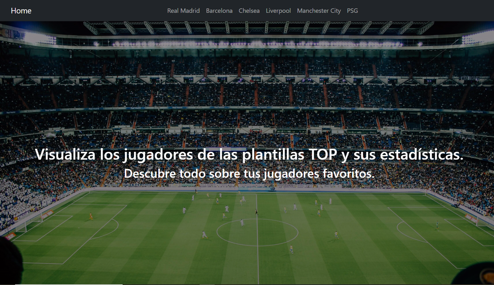
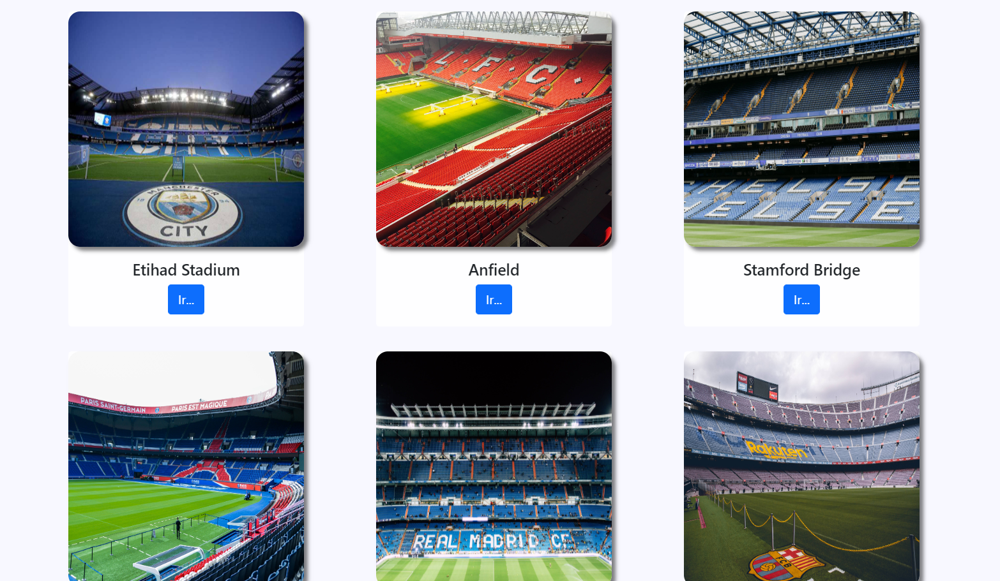
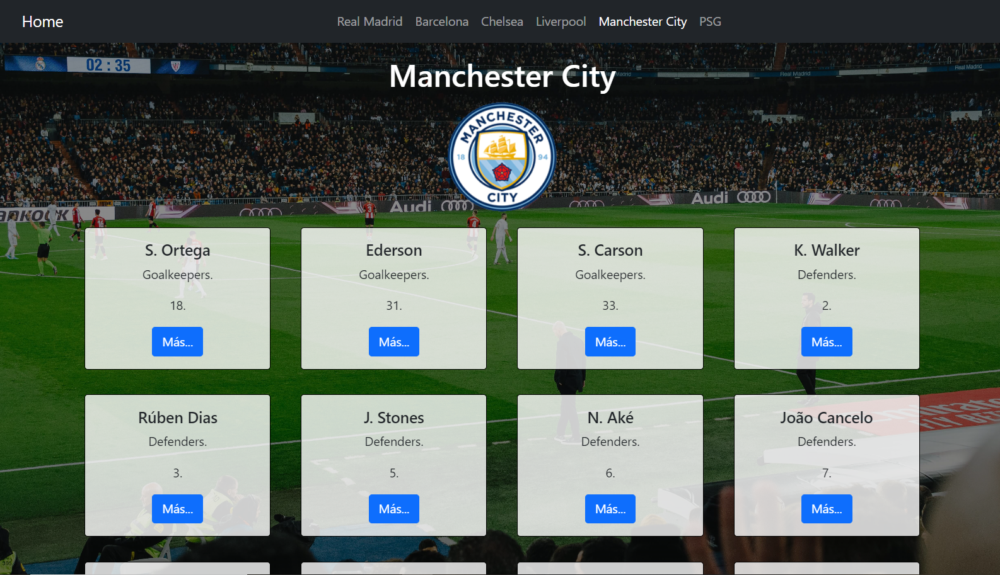
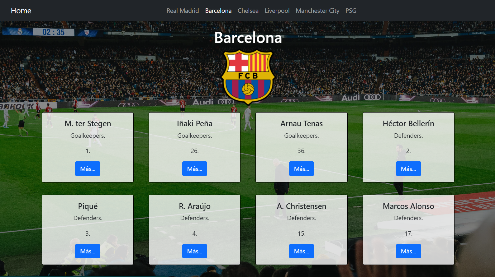
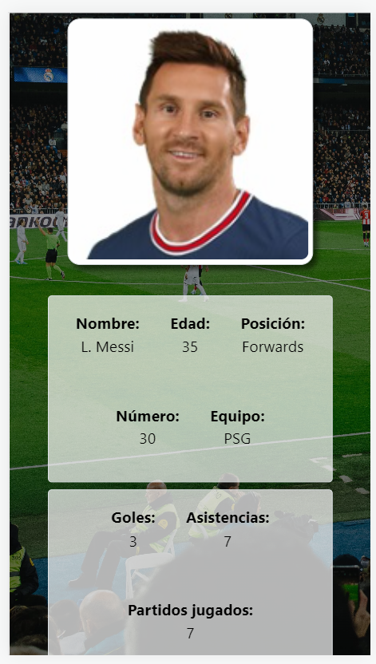
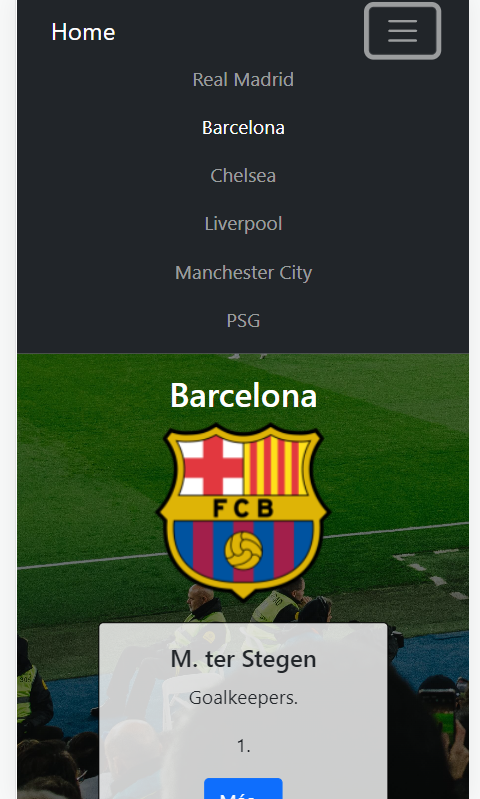

# Jugadores Top.

Desarrollo de una aplicación la cual visualiza la plantilla de los equipos europeos, además de reflejar la estadística de sus jugadores, partidos jugados, minutos jugados, goles, asistencias etc.

- Deploy: [Jugadores Top App](https://jugadorestop.netlify.app/)

 

 

 

### El reto

Los usuarios deben poder:

- Ver el diseño óptimo para el sitio según el tamaño de la pantalla de su dispositivo.
- Ver estados y animaciones de desplazamiento para los elementos interactivos en la aplicación.
- Poder visualizar los equipos y los jugadores.
- Ver estadísticas de jugadores individuales.
- Desplazarse por la aplicación a través de rutas en el url.
- Intercambiar de equipo mediante el menú superior.
- Interactuar con el menú responsive.

 

 

 

### Construido con:

- React JS.
- React Router.
- Bootstrap 5.
- JavaScript.
- API: [All Sport Api](https://allsportapi.com/)
- HTML 5.
- CSS custom properties.
- Flexbox.
- Diseño responsive.

### Lo que aprendí:

Gracias a este proyecto pude aprender:

- React, Hooks, useEffect, useState, Customs Hooks.
- Manejar rutas con React Router, Hooks de React Router useParams, useNavigate.
- Peticiones asíncronas con la Api Fecth de Javascript.
- Mejorar mis habilidades con Bootstrap 5.

 

 

## Author:

### Diego Rangel.

- Twitter - [@darf_132](https://www.twitter.com/darf_132)
